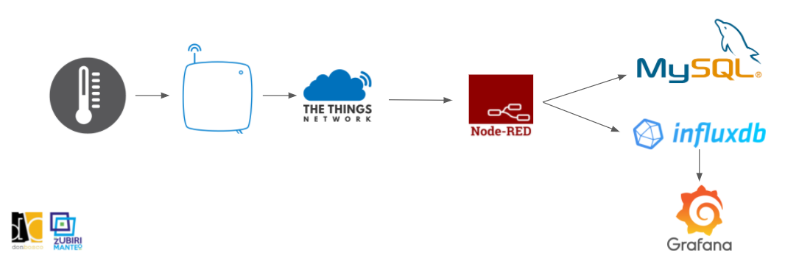
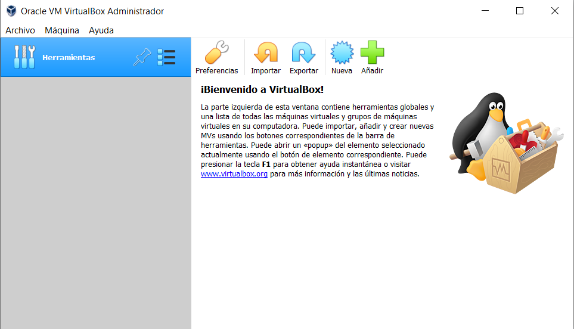
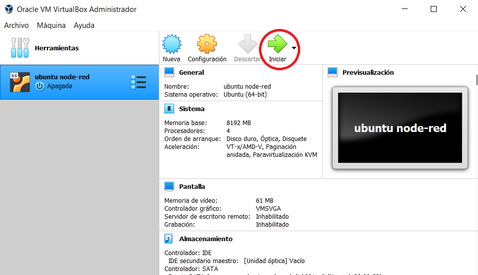
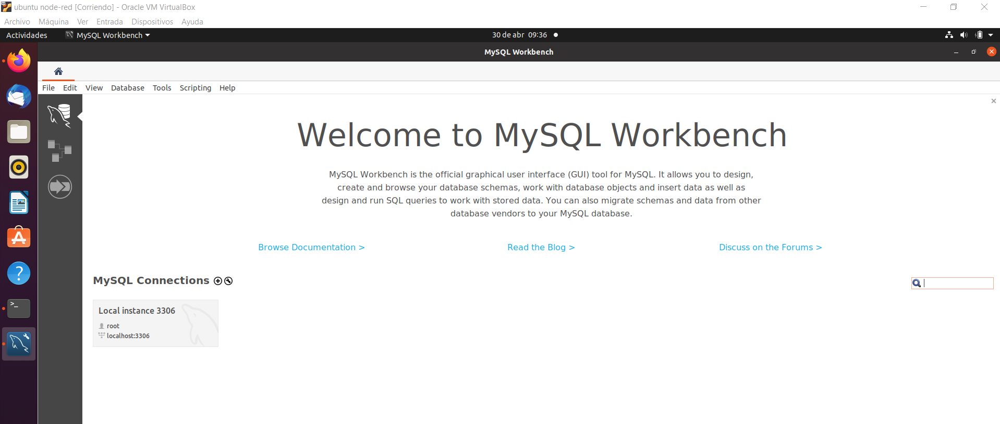
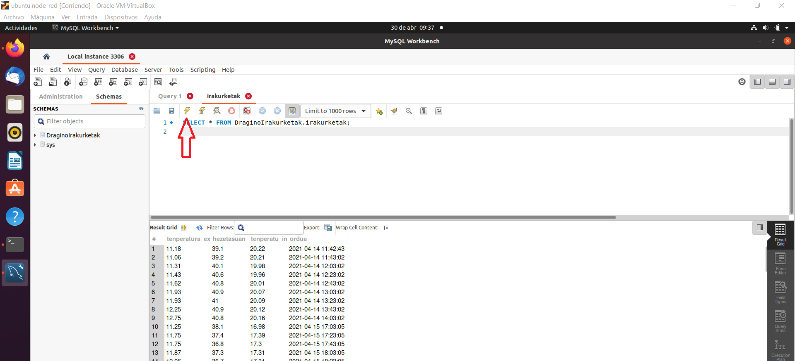
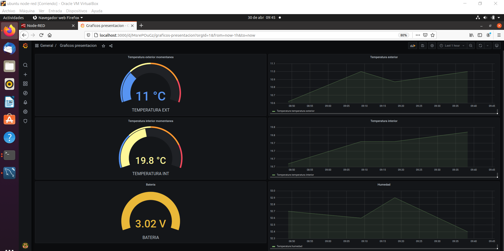

En este documento se explica cómo usar la máquina virtual que hemos creado donde viene con el software instalado para poder graficar los datos de un sensor LoRa que hay en [CIFP Don Bosco LHII](https://donbosco.eus/). 

A modo de prueba conceptual hemos usado 2 bases de datos en paralelo. Una base de datos relacional llamada MySQL y una base de datos secuencial llamada influxdb. Los datos de esta última se pueden ver graficados en Grafana, no así los de MySQL.

## El primer paso abrir la máquina virtual

1. Descargar e instalar [Virtual Box](https://www.virtualbox.org/wiki/Downloads) en nuestro caso hemos usado la versión para windows.

2. Cerramos y descargamos de la página de Virtual Box Extension Pack, para ello pulsamos sobre “All supported platforms” y lo instalamos. 

   

3. Descargamos la Máquina Virtual que hemos preparado con [Ubuntu de nuestro Drive](https://drive.google.com/file/d/1JQhKaMk6mX4iVsSaHtvDTlkLvJG9sksW/view?usp=sharing)

4. Cargamos en VM la máquina virtual la máquina Ubuntu: Archivo/Importar servicio virtualizado seleccionamos la máquina que hemos bajado y siguiente siguiente hasta que acabe de cargarla

5. Pulsamos en Iniciar la máquina virtual y esperamos a que se acabe de cargar la máquina.

   

6. Hay un usuario creado llamado Ubuntu con lo que solo tendremos que poner la contraseña: ubuntu.ivan

## Segundo paso establecer la comunicación MQTT con Node-Red

1. Una vez abierto Ubuntu, abajo a la izquierda pulsamos sobre el botón con 9 cuadrados. Arriba en “escribir para buscar” escribimos “Terminal” y ejecutamos el comando: node-red

   

2. Una vez ejecutado node-red en el terminal, sin cerrarlo, abrimos el navegador y ya podemos acceder a Node red escribiendo esta url: http://localhost:1880/

   

## Tercer paso puesta en marcha de MySQL

1. Sin cerrar el Terminal con node-red, pulsamos abajo a la izquierda sobre los 9 cuadraditos. Escribimos MySQL (el delfín) y ejecutamos “local Instance 3306” con el password: 1234

   

2. Para poder refrescar los datos que van entrando a MySQL hay que pulsar Control+Intro o pulsar el botón del rayo de arriba
   

## Cuarto paso puesta en marcha de InfluxDB

1. Vamos a abrir otro tipo de base datos, en este caso InfluxDB. Para ello hay que abrir una ventana Terminal nueva y escribir: influx
2. De seguido escribimos: “use dragino” para entrar en la base de datos con ese nombre
3. Seleccionamos la tabla que queremos que muestre los datos capturado, escribiendo: “select * from Temperature”

## Quinto paso graficar los datos en Grafana

1. Sin cerrar la ventana de InfluxDB vamos a visualizar los datos mediante gráficos. Para abrir grafana, hay que ir al navegador y poner esta url: http://localhost:3000 y seleccionar “gráficos presentación”

   

En los gráficos mostrados podemos ver:

- La temperatura externa actual
- La temperatura interna actual del aula SmartSpace
- La batería del nodo actual
- La evolución de la temperatura exterior
- La evolución de la temperatura interior del aula SmartSpace
- La evolución de la humedad del aula SmartSpace