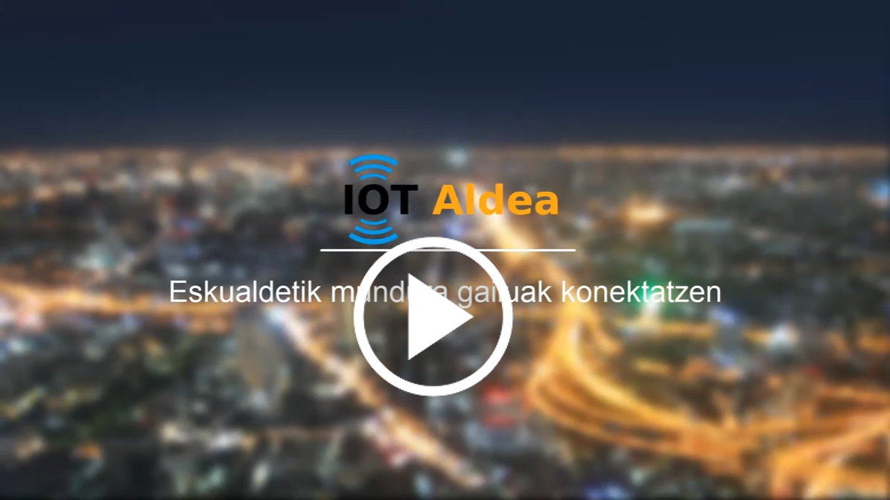

El objetivo que tenemos es acercar y difundir los sistemas LoRa en la sociedad a distintos niveles. Para ello colaboramos 2 profesores de Formación Profesional, de manera de unir los conocimientos de [CIFP Don Bosco](http://fpdonbosco.com/) y [IES Zubiri-Manteo](https://zubirimanteo.hezkuntza.net/eu/inicio). El primero con experiencia en electrónica y telecomunicaciones y el segundo en informática y bases de datos. 

Para lograr eso hemos desarrollado IOT aldea con estos objetivos:

- Creación de una infraestructura abierta de LoRa para que cualquiera de la comarca de Oarsoaldea pueda tener cobertura LoRa para poder usar y desarrollar aplicaciones de Internet Of Things.
- Adquirir conocimiento técnico de redes de datos LPWAN por parte del profesorado de Don Bosco y Zubiri-Manteo para adecuar las competencias profesionales de los estudiantes.
- Dar a conocer la tecnología LoRa para el uso en el Internet de lasa Cosas y difundir el conocimiento.
- Digitalizar mediante telegestión y telelectura el suministro de agua del municipio de Pasaia

Hemos intentado estructurado el proyecto para que la curva de aprendizaje sea suave. Partiendo de los mínimos componentes que hacen falta para poner en marcha un sistema IOT con LoRa. Para poco a poco ir añadiendo complejidades y profundizando en cada uno de los elementos necesarios.

En la imagen de abajo se puede ver que la arquitectura  simplificada de un sistema de comunicación LoRa podría resumirse en 4 elementos interconectados de manera lineal.

1. Tutorial creación de [un sistema IOT con LoRa simple](./Sistema_Simple/Sist-Simple-LoRa.md) partiendo de 0
2. Tutorial de [uso de una máquina virtual con todo el software necesario para visualizar nuestro Dragino LHT64 en un dashboard.](./Maq.Virtual/Maq.Virtual.md)
3. Tutorial de [Instalación y configuración de aplicación para leer los datos mediante Telegraf, guardarlos en InfluxDB y visualizarlos en Grafana](./TIG/TIG_simple.md).
4. Varios materiales avanzados
   - Video: [Configuración gateway LoRa RAK7249 y LoRa RAK7258](https://www.youtube.com/watch?v=WUNrpj3dMew) / [RAK7249 y LoRa RAK7258 LoRa gatewayaren konfigurazioa](https://www.youtube.com/watch?v=H9vIBrn2kCU)
   - Video: [Leer datos de The Things of Network mediante MQTT](https://www.youtube.com/watch?v=ZnBAOsWYcM4) / [The Things of Network-eko datuak MQTT bidez irakurri](https://www.youtube.com/watch?v=NQOg4B4KH-I)

