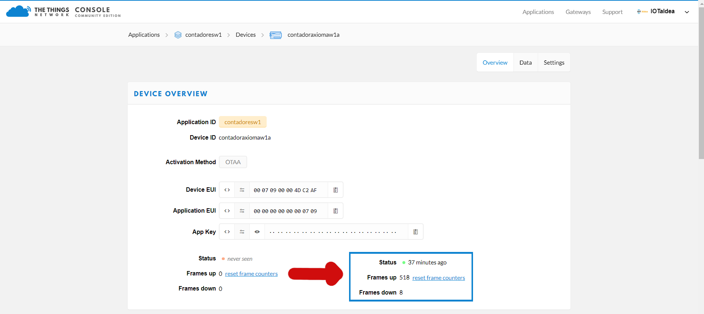

El Network Server es el servidor que une los datos de los nodos con las aplicaciones de manera segura. Esta puede estar de manera local o en la nube, puede ser pública o privada. Hay varios Network Servers entre los más destacables: The Things of Network, Loriot, LoRa Server... cada cual tiene sus características y sus servicios con un costo económico o otro.

Ante la variedad de Network Servers que podemos encontrar nos centraremos en el The Things of Network porque para empezar creemos que es la mejor solución. Si hay cobertura de Gatesways-TTN en la zona puedes usar el gateway que alguien ha puesto para enviar los datos de tus nodos. Los datos están encriptados por lo que aunque se use la autopista de TTN el acceso al dato desde cualquier sitio solo lo tienes tu. 

En su github tienen publicado su [Manifiesto](https://github.com/TheThingsNetwork/Manifesto) que resumidamente se centra en tres ideas:

- Tus datos son tus datos, los datos son cifrados punto a punto.
- Neutralidad de la red, todos los datos se tratan con igualdad.
- Open source, la tecnología desarrollada se hace abierta.

En la práctica es importante entender un detalle, **los datos no se almacenan**, para poder almacenarlo habrá que crear alguna aplicación que se dedique a almacenarlos.

En The Things of Network se pueden hacer 2 cosas, crear un gateway o crear una aplicación.

## Si queremos meter nuestro gateway en la red TTN:

1. Accedemos a la web de [The Things Network](https://www.thethingsnetwork.org/) y si no tenemos creamos una cuenta de usuario

2. En la sección [Console](https://console.thethingsnetwork.org/) Registramos nuestro Gateway para ello usaremos el número EUI del gateway y clickaremos en la opción de “I’m using the legacy packet forwarder”. El EUI se puede obtener en la caja de cartón del Gateway o en el entorno web del gateway.

   

3. Al finalizar si se ha configurado correctamente y hay comunicación entre el gateway y TTN podremos ver que su estado cambia a conectado. Tras lo cual si queremos podemos añadir más datos sobre el gateway en la sección de "Settings".

   

## Si tenemos cobertura de un gateway TTN y queremos conectar un nodo a TTN:

1. Accedemos a la web de [The Things Network](https://www.thethingsnetwork.org/) y si no tenemos creamos una cuenta de usuario

2. En la sección [Console](https://console.thethingsnetwork.org/) creamos una Application, donde le pondremos un nombre en minúsculas en el campo Appication ID y en la Description podremos describir nuestra aplicación. TTN asigna automáticamente una EUI a esa aplicación.

   

3. Tendremos que editar la APP EUI que ha generado automáticamente TTN y asignarle la que trae el nodo.

4. Una vez que tenemos la Application de TTN, dentro de ella asignaremos los nodos. Para ello tendremos que poner el DEV EUI y App KEY que tiene el nodo (en nuestro caso un sensor LHT65) normalmente en una pegatina. **En una Application puede haber varios nodos pero no puede haber el mismo nodo en varias Application en The Things Network.**

5. Tras configurar el TTN solo queda conseguir que el nodo (en nuestro caso LHT65) empiece a transmitir. El LHT65 empieza a transmitir cada 20 minutos hay que encenderlo pulsando el botón ACK durante 5 segundos pero cada dispositivo es diferente. Una vez que el nodo se conecte con TTN, dentro del Devices de la Applications podremos ver como cambia el Status y empezará a incrementar el contador de payload recibidos.

   

   

   ## Visualización de datos recibidos en TTN

   Una vez que se reciben los datos en TTN si no se hace algo con ellos se borran. ¿Pero que tipo de datos recibe? TTN recibe un churro de datos hexadecimales que de primeras no dicen nada y para poder entenderlo hay que descodificarlo.

   En la pestaña Data del nodo (OJO no confundirse con la pestaña Data de la aplicación) podemos ver los datos que están llegando con su Payload en formato hexadecimal. En la foto de abajo, se puede ver 3 veces el mismo payload: CBE00809026A0106B07FFF. Además se puede ver como el contador llevaba 523 payloads enviados, se reinicia porque he forzado un emparejamiento nuevo y TTN ha asignado un DEV ADDR nuevo y muestra los APP EUI y DEV EUI del nodo.

   
