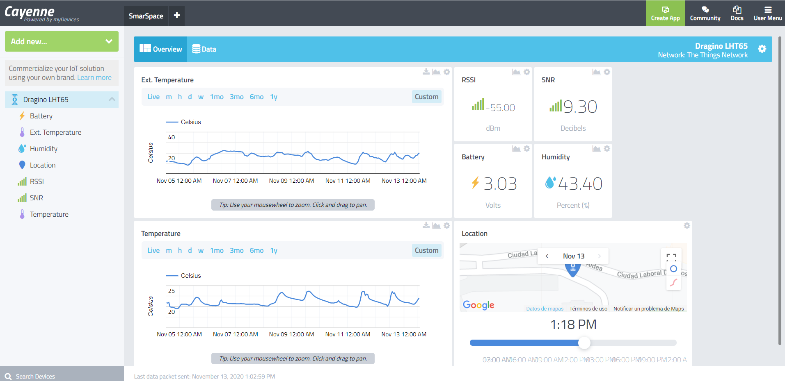
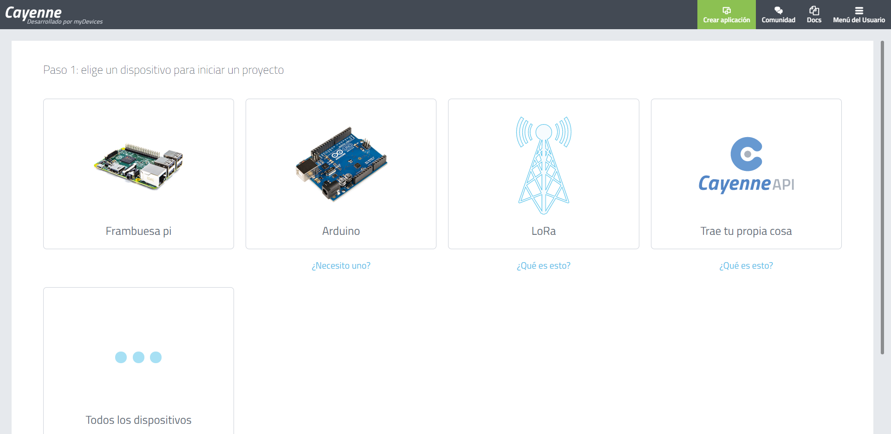
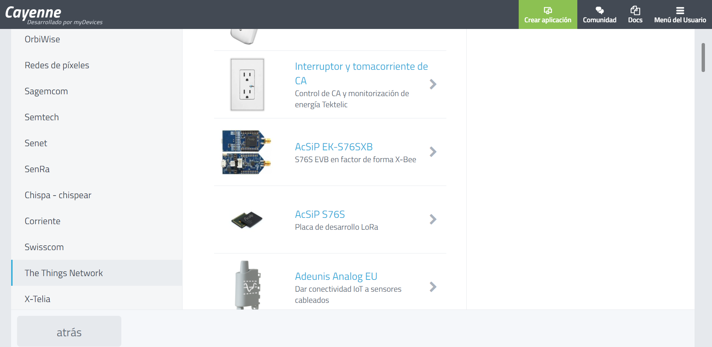
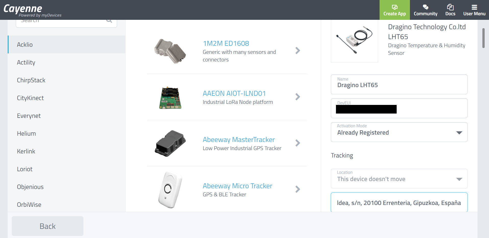

Las Aplicaciones serían la razón para el que hemos montado el sistema de LoRa. Hay múltiples aplicaciones posibles (Bases de datos, dashboards, webs, alarmas, aplicaciones móviles...) y su nivel de complejidad es muy variable dependiendo de la personalización que queramos que tenga la aplicación.

El objetivo que tenemos al conectar por primera vez un sensor LoRa es obtener los resultados de manera digital, fácil y perdurable en el tiempo. Para ello explicaremos 2 aplicaciones sencillas donde se usarán herramientas de terceros con un nivel de personalización bajo y con limitaciones de uso pero muy sencillas de implementar.

## Base de datos TTN:

The Things Network de por si no guarda los datos solo es posible verlos en la web si se está conectado a la plataforma o si hay una base de datos escuchando. Una manera sencilla de poder obtener los datos es activar una base de datos limitada (solo guarda los datos de los últimos 7 días)  que escuche los datos que llegan a TTN. 

Para ello tenemos que seleccionar la aplicación que queremos monitorizar en TTN ([Video de todo el proceso](https://www.youtube.com/watch?v=kVf8GmCbOuE)) y elegir la pestaña de Integrations. TTN trae algunas aplicaciones integradas para que puedan ser utilizadas de manera sencilla. Elegiremos Data Storage y pulsaremos el botón de añadir la integración.

A partir de ahora los datos se irán guardando en la base de datos pero para poder verlos habrá que dar algunos pasos. 

1. Tenemos que copiar el Access Key que tiene nuestra aplicación de TTN. 

2. En nuestra Aplicación "dragino_test_aplicacion" de TTN seleccionamos las Integrations/Data Storage/go to platform. En ella tras pulsar en el botón de Authorize pegaremos el Access Key en la ventana que se nos ha abierto. 

3. Hay diferentes manera de ver los datos, pero para ver todos los datos hay que seleccionar GET /api/v2/query y escribir 7d en el recuadro value, para poder ver los datos de los últimos 7 días. La información se muestra en formato JSON

    

Puede que solo se vean los 3 últimos campos (devide_id, raw y time) pero eso es tema de codificación que se tratará más adelante.

## Cayenne: Base de datos y dashboard

[Cayenne myDevices](https://cayenne.mydevices.com/) permite diseñar, crear prototipos y visualizar rápidamente soluciones de IoT (no solo de LoRa). Además se puede utilizar Cayenne como una herramienta para visualizar datos históricos y en tiempo real, enviados a través de The Things Network.

La página web es simple pero en mis pruebas si no se hace como comentaré, da problemas y no se consigue visualizar los datos. Para ello deberemos:

1. Igual que en la aplicación anterior (Data Storage), en TTN hay que seleccionar la aplicación a la que queremos integrar un aplicación. Dentro de dragino_test_aplicacion Applications seleccionamos Integrations y añadiremos una nueva integración llamada myDevices. 
2. La creación de la integración es muy simple solo hace falta poner un nombre a Process ID y en Access Key seleccionar default key.
3. En Cayenne tras registrarnos y pulsamos sobre Crear Aplicación. En el paso 1 elegimos un dispositivo "Todos los dispositivos". (No he conseguido seleccionando LoRa hacerlo funcionar con The Things Network)
4. Hay que seleccionar el tipo de dispositivo que es, en nuestro caso The Things Network 
5. En el buscador de arriba, buscamos Dragino LHT65, lo seleccionamos y rellenamos los datos de la derecha. Name, DevEUI y la dirección. Tras lo cual ya se mostrará los datos en gráficas 