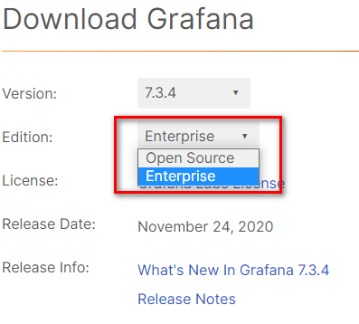
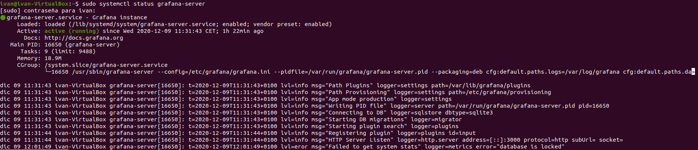
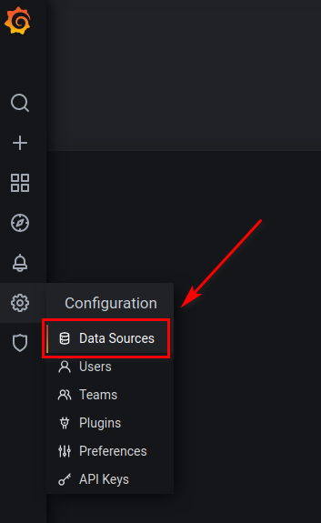
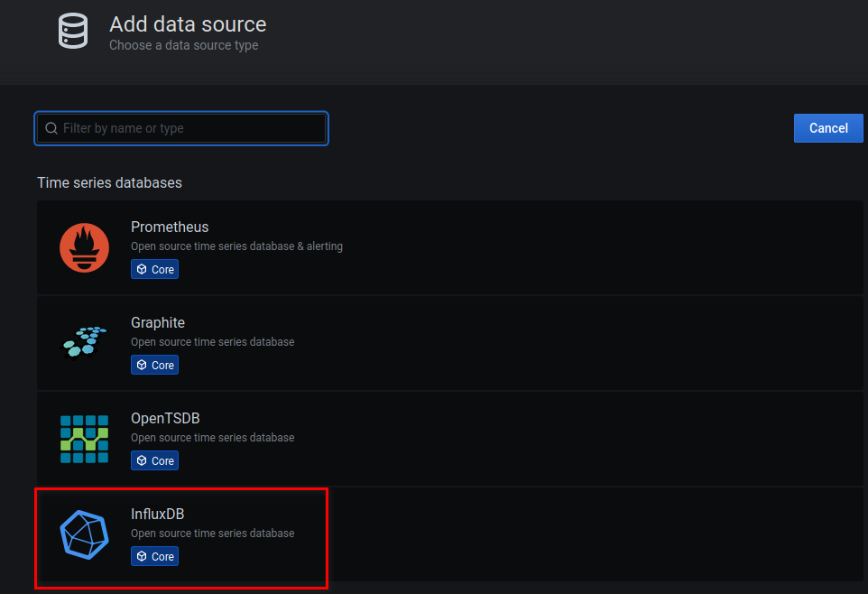
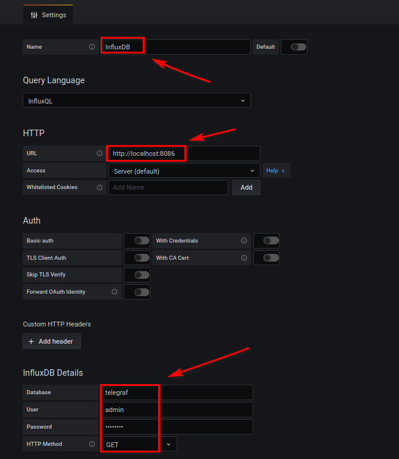
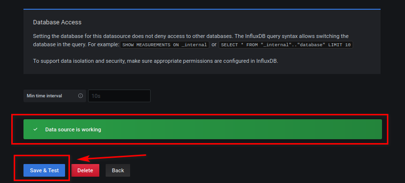
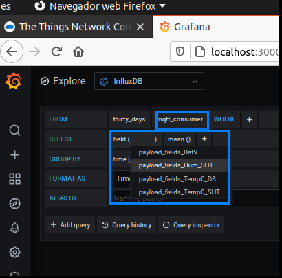
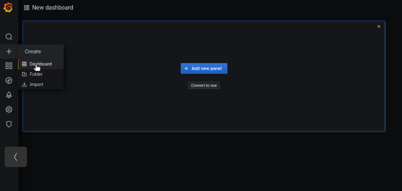
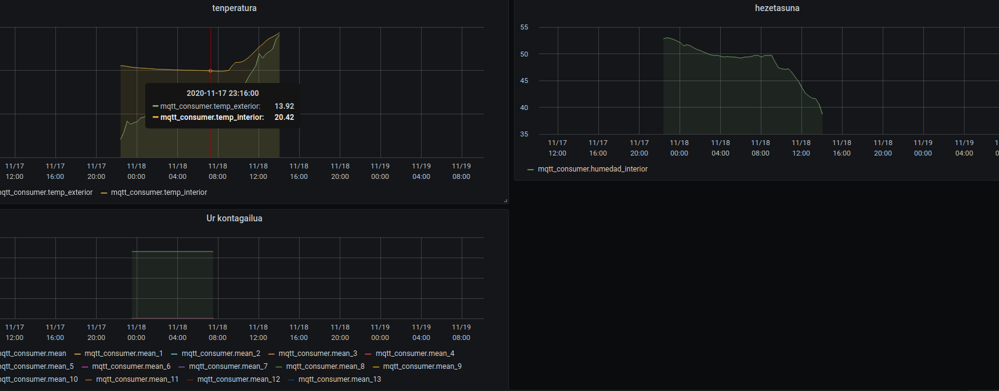

## Instalación y Configuración de Grafana

Grafana es una plataforma de código abierto para el monitoreo, análisis y visualización de datos que viene con un servidor web que le permite acceder a él desde cualquier lugar. En la interfaz web, los usuarios pueden crear paneles de Grafana con paneles para representar métricas a lo largo del tiempo.

Vamos con el último paso, cómo instalar y configurar Grafana, pasos sencillos pero que hay que hacer paso a paso. Comenzamos.

Hay dos ediciones disponibles y para nuestras pruebas hemos utilizado la versión **OpenSource**.



Se puede instalar Grafana descargándola directamente desde su [sitio web oficial](https://grafana.com/grafana/download), o mediante [repositorio de APT](https://www.digitalocean.com/community/tutorials/ubuntu-and-debian-package-management-essentials#debian-package-management-tools-overview). Debido a que un repositorio de APT facilita la instalalación y administración de las actualizaciones de Grafana, [utilizaremos este método](https://grafana.com/docs/grafana/latest/installation/debian/).

Yo creo que de manera predefinida ya estarán las siguientes dos dependencias, pero, en cualquier caso, lanzamos el siguiente comando para meterlas en las dependencias:

```
sudo apt-get install -y apt-transport-https
sudo apt-get install -y software-properties-common wget
```

Ahora vamos a obtener los paquetes de Grafana de manera segura, para ello añadimos la clave GPG key de Grafana a nuestro sistema. Esto agregará la clave a la lista de claves de confianza de la instalación de APT, que le permitirá descargar y verificar el paquete Grafana firmado con GPG:

```
wget -q -O - https://packages.grafana.com/gpg.key | sudo apt-key add –
```

A continuación, agregamos el repositorio de Grafana a las fuentes de APT:

```
echo "deb https://packages.grafana.com/enterprise/deb stable main" | sudo tee -a /etc/apt/sources.list.d/grafana.list
```

Después de esto añade el repositorio, actualizando el caché de APT para actualizar las listas de paquetes y después proceder con la instalación:

```
sudo apt-get update
sudo apt-get install grafana
```

Una vez que se haya instalado Grafana, utilice **systemctl** para iniciar el servidor de Grafana:

```
sudo systemctl daemon-reload
sudo systemctl start grafana-server
sudo systemctl status grafana-server
```



Si queremos que el servidor Grafana se inicialice de forma automática en el arranque tendremos que realizar lo siguiente:

```
sudo systemctl enable grafana-server.service
```

Ahora ya podremos ir al navegador y abrir Grafana en el web browser:

**Dirección:** La dirección donde esté instalado Grafana (http:GrafanaIP:3000/login) en nuestro caso http://127.0.0.1:3000/login ya que está instalado en local.

**Usuario:** admin

**Password:** admin

La primera vez se nos pedirá que cambiemos el password.

Una vez nos logueemos veremos esta pantalla de inicio:


Como precaución podemos deshabilitar el registro automático de usuarios editando para ello el fichero /etc/grana/grafana.ini y nos aseguraremos que estas líneas están así:


Y haremos un reinicio de Grafana:

```
sudo systemctl restart grafana-server
```

Ahora añadiremos orígenes de datos de InfluxDB haciendo click en Data Sources:






Y tendremos que marcar todas las opciones que vemos en la siguiente imagen:



Cuando hagamos “**Save & Test**”, si todo está bien, veremos una barrita verde diciendo que funciona:



Ahora iremos al **Explorer** de Grafana y veremos si tenemos los datos que nos llegan desde Telegraf, que estos a la vez son los datos que vienen del TTN.



La tabla desde donde recibiremos la información será el “**mqtt_consumer**” que hemos definido en la configuración del input de Telegraf. Como vemos en la imagen anterior tan sólo tenemos como columnas a elegir los datos leídos desde el TTN (**payload_fields_BatV, payload_fields_Hum_SHT, payload_fields_TempC_DS, payload_fields_TempC_SHT**).

A partir de aquí quedaría graficar los datos que se vayan leyendo y guardando en InfluxDB y visualizarlos en un Dashboard de Grafana.



Como ejemplo, mostraremos unos ejemplos de Dahsboard realizados a partir de datos recibidos desde el nodo Dragino (**Dragino LHT65 Temperature & Humidity Sensor**) y nodo medidor de agua (**AXIOMA QALCOSONIC W1 - Medidor de agua ultrasónico inteligente**)



Con esto habríamos finalizado todo el proceso desde la obtención de los datos de TTN (Telegraf), pasando por guardarlos en una base de datos (InfluxDB) y finalizando al verse los datos como gráficos (Grafana)