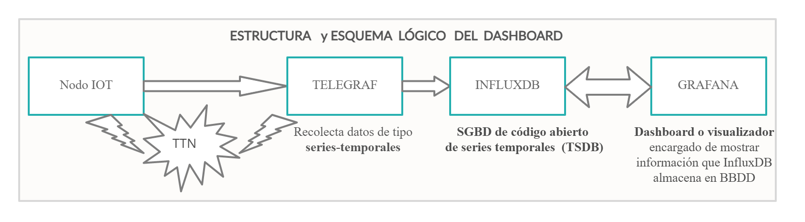

## Creando Aplicaciones para LoRa con TIG

Mediante este tutorial se quiere explicar como llegar a visualizar en un Dashboard los datos de un nodo LoRa. Se parte que ya hemos comunicado un nodo LoRa, con un Gateway y conectado a The Things Network. Si no sabes como hacerlo, empieza por "creación de [un sistema IOT con LoRa simple](../Sistema_Simple/Sist-Simple-LoRa.md) partiendo de 0".

Entre los bloque que está compuesta la arquitectura de un sistema LoRa la parte menos accesible y la que mayor valor le da al sistema, es la parte de la Aplicación. En el tutorial de creación de un sistema IOT con LoRa simple se a usado a modo de aplicación, sistemas cerrados, con limitaciones pero sencillos de configurar. Ahora se busca profundizar en sistemas más complejos pero que permitan mayor libertad y control de los datos y aplicaciones.

Una vez que el dato del nodo llega al Network Server (The Things Network en nuestro caso) si no se hace nada con ello desaparece. Para no perderlo, primero hay que leerlo (Telegraf), luego hay que guardarlo en una base de datos (InfluxDB) y luego mostrarlo en un visualizador (Grafana).

A continuación explicaremos los pasos que hay que dar con cada uno de los bloques de manera independiente:

- [Instalación y configuración de InfluxDB](./InfluxDB.md)
- [Instalación y configuración de Telegraf](./Telegraf.md)
- [Instalación y configuración de Grafana](./Grafana.md)

Nosotros hemos realizado todos los pasos dentro de una máquina virtual y dejamos accesible para evitar que la gente se bloquee por problemas en la instalación. Solo hay que poner la máquina en marcha y el sistema funcionará.

